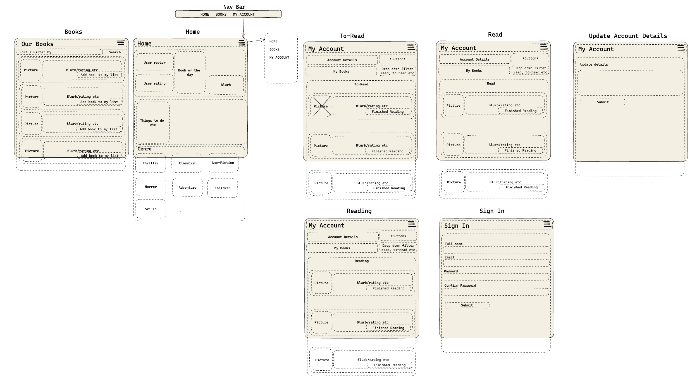
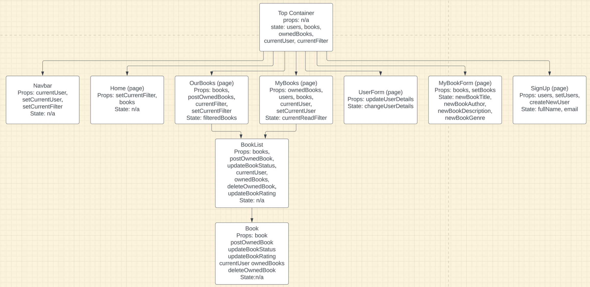

# Bookkeeper FrontEnd Project 📖

## Collaborators

- James Emery (GitHub: [J-emery](https://github.com/J-emery))
- Chinika Charles (GitHub: [ChinikaC](https://github.com/ChinikaC))
- Ryder (GitHub: [rrydderr](https://github.com/rrydderr))

## Table of Contents
1. Project Description
2. Diagrams
3. Tech Stack
4. Setup Instructions
5. Future

## 1. Project Description

For our frontend project, we were tasked with creating the client-side for another group's backend project (API). We were assigned the bookkeeper API which is a book inspired API, where users could add a book the main booklist which came with app to their personal booklist. They could also categorise each book into three categories: To read, reading and read. A filter function also allowed users to filter books based on the author, genre and rating. 

Other functionalities include adding a new book and new user, updating a user's personal details and deleting a user account.

## 2. Diagrams

### Wireframe

Our wireframe displays what we originally intended our website to look like. We have the different sections - home, our books, update account details and sign in, and then the 'to-read', 'reading' and 'read' comes under the user account section. In our final product, we decided to not include images of the books for a more sleeker look, however, the rest of the design was almost identical to our finished product.

### Component Diagram

Our component diagram indicates the different sections that we had. This includes our TopContainer, pages and components and how they inherit from one another.

## 3. Tech Stack

The technologies used in this project were:
- JavaScript
- React.js
- HTML
- CSS
- [The bookkeeper API](https://github.com/aya-rh/bookkeeper_backend_project)

## 4. Setup Instructions

**Instructions for the API:**
**1. Installation:** 
The following will need to be installed onto your device:
- Intellij IDEA , running with JDK 17
- Postgres
- Postman
- Postico

**2. Cloning:** 
You will need to clone the API repository onto your device. Navigate back to the API ([click here](https://github.com/aya-rh/bookkeeper_backend_project)) and click on the green 'Code' button at the top of the page. Select SSH and copy the link, or simply copy it from here: git@github.com:aya-rh/bookkeeper_backend_project.git. 

Next, open your terminal and type in this command:
`git clone git@github.com:aya-rh/bookkeeper_backend_project.git`

Then press enter and open the file.

3. PostgreSQL database:
Create a PostgresSQL database named 'bookkeeper_api' by opening your terminal and typing in the following command: 
`createdb bookkeeper_api`

**NOTE:** You can use postico to check this has been created successfully.

4. Running the application: 
After opening your cloned bookkeeper_backend_project file in Intellij IDEA, go to the 'BookkeeperBackendProjectApplication' section and press the play button at the top of the file. This will run the API. Also ensure that it is running on port 8080.

**NOTE:** If you would like to check if the endpoints are all working, you can test this in Postman. To view the different endpoints, use this ([link](https://github.com/aya-rh/bookkeeper_backend_project)) and scroll down to the 'RESTful route endpoints' section.

  

 **Instructions for the client-side:**

 1. Installation: 
The following will need to be installed onto your device:
- Visual Studio Code

2. Cloning: 
You will need to clone this repository onto your device. Scroll to the top of this page and click on the green 'Code'. Select SSH and copy the link, or simply copy it from here: git@github.com:ChinikaC/FrontEnd_Project_Bookkeeper_App.git. 

Next, open your terminal and type in this command:
`git clone git@github.com:ChinikaC/FrontEnd_Project_Bookkeeper_App.git`

3. Installation Pt.2: 
Go to your terminal and write the following commands:
- For Node Modules: `npm install or npm i`

- For React Router: `npm install react-router-dom \nnpm install --save styled-components`

- For React Stars: `npm install react-rating-stars-component --save`

- For React Tippy: `npm install --save react-tippy`

- For React Icons: `npm install react -icons`

4. Running the React application:
Type the following command into your terminal:
`npm start`

A new page should open on your browser. If you have any difficulty with this, you can type the following into your browser:

http://localhost:3000

